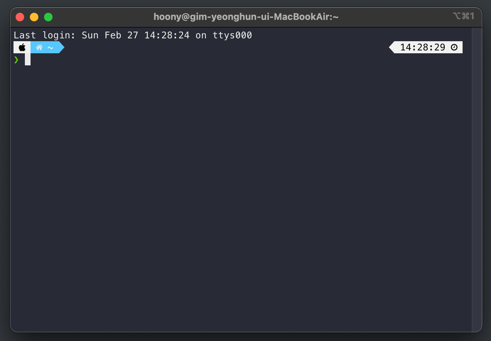
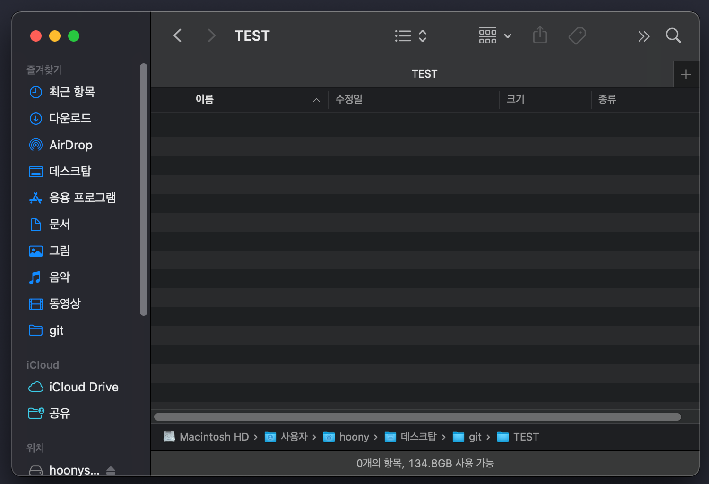
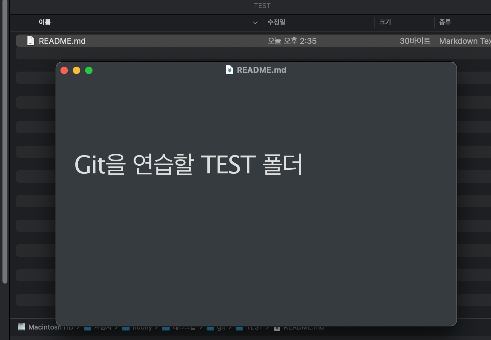
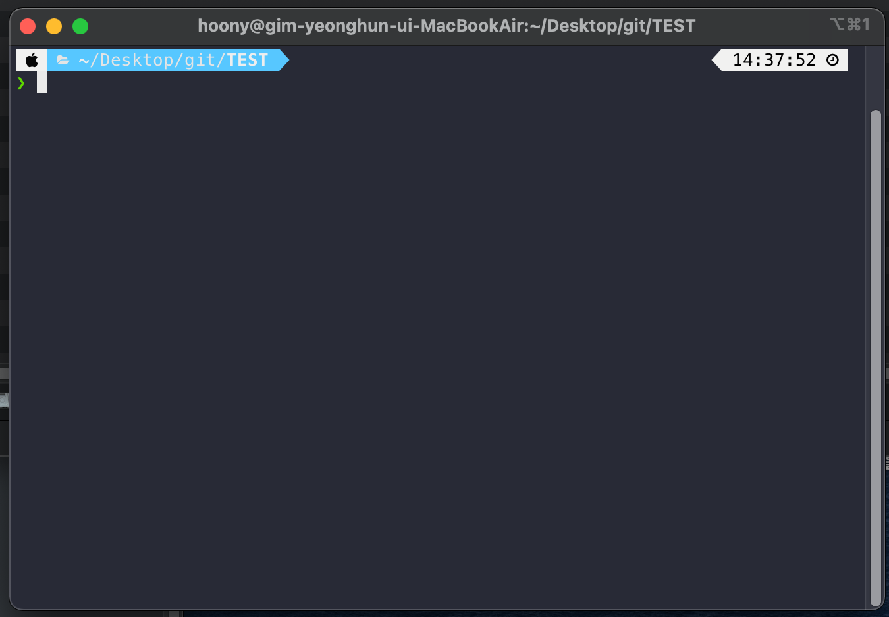
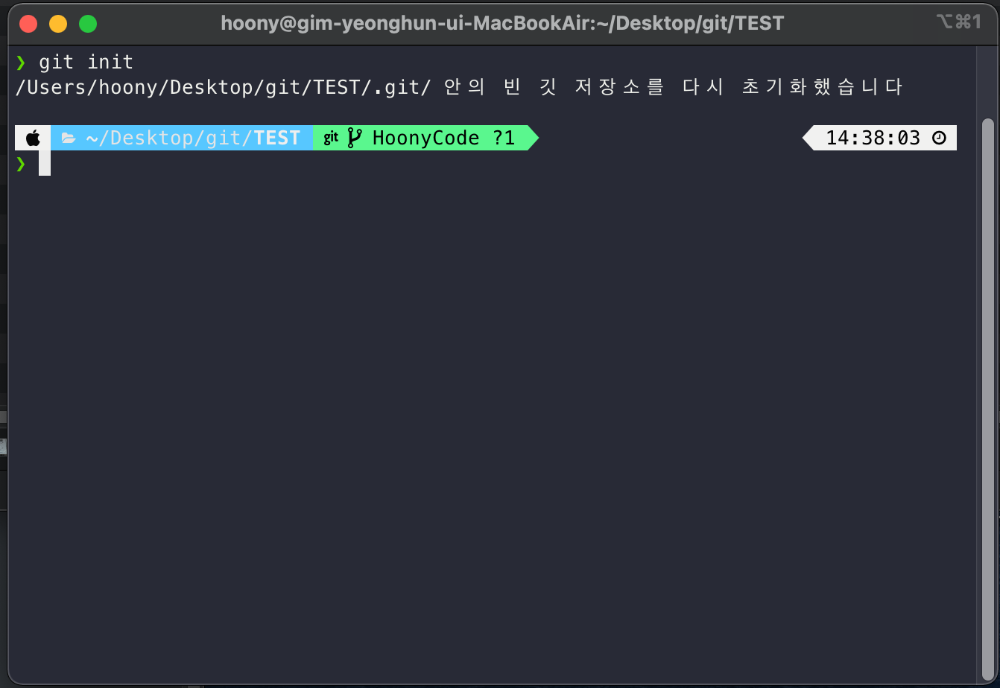
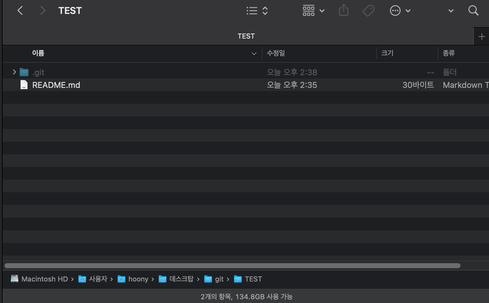

# Git을 설치하고 로컬저장소에서 커밋 관리하기


## 내 컴퓨터에 Git 설치하기

현재 컴퓨터는 mac os를 사용하고 있어서 git를 깔 필요가 없다!




## 로컬 저장소 만들기

로컬 저장소란?

> 실제로 Git을 통해 버전 관리가 이워질 내 컴퓨터에 있는 폴더입니다.

- test이름의 폴더를 내 컴퓨터에 만듭니다.




- TEST 폴더 안에 텍스트 문서를 하나 만듭니다. 프로젝트에 설명이 담길 텍스트 파일입니다.




- TEST폴더에서 terminal을 엽니다




- git init 명령어를 사용합니다.



- 초기화 되었다 라는 텍스트가 나오면 성공입니다.

- .git 파일이 생깁니다



> [.git] 폴더에는 Git으로 생성한 버전들의 정보와 원격저장소 주소 등이 들어 있는데요, [.git] 폴더를 우리는 로컬저장소라고 부릅니다.


## 정리

> 일반 프로젝트 폴더에 'git init' 명령어 (Git 초기화 과정이라고 합니다)를 통해 로컬 저장소를 만들면 그때부터 이 폴더에는 버전 관리를 할수 있다.


## 첫 번쨰 커밋 만들기

방금 생성했던 README.md 파일을 하나의 버전으로 만들어보겠습니다. Git에서는 이렇게 생성된 각 버전을 커밋 `commit`이라고 부릅니다.


1. 먼저, 버전 관리를 위해 내 정보를 등록해야 합니다. 각 버전을 누가 만들었는지 알아야 협업하기 편하기 때문입니다.

- terminal을 열고 자신의 이메일과 이름을 등록합니다.

```bash
❯ git config --global user.email "자신의 주소"
❯ git config --global user.name "자신의 이름"
```


2. 커밋에 추가할 파일을 선택합니다. 조금 전 만들어 놓은 README.md 파일로 해 보겠습니다. 다음 명령어를 terminal에 입력합니다.

```bash
❯ git add README.md
```

3. 커밋에는 상세 설명을 적을 수 있습니다. 설명을 잘 적어놓으면 내가 이 파일을 왜 만들었는지, 왜 수정했는지 알 수 있고, 해당 버전을 찾아 그 버전으로 코드를 바꿔 시간 여행을 하기도 수월합니다. 우리는 'GIt 설명'라는 설명을 붙여서 첫 번째 커밋을 만들어 보겠습니다. 다름 명령어를 입력합니다.

```bash
❯ git commit -m "Git 설명"
[HoonyCode (최상위-커밋) be3ebc9] Git 설명
 1 file changed, 1 insertion(+)
 create mode 100644 README.md
```

4. -m은 'message'의 약자입니다. `1 file changed, 1 insertion(+)` 텍스탁 보이면 성공입니다.

5. 우리는 방금 첫 번째 버전을 만들었습니다. 이번에는 README.md 파일을 수정하고 두 번째 커밋을 해봅시다. 파일을 열어 맨 뒤에 '짱'이라고 적고 메모장을 저장합니다. 현재 README.md 파일이 있는 폴더에 그대로 저장합니다.

6. `add` 명령어로 README.md를 선택하고 '설명 업데이트'라는 설명을 붙여서 `commit` 명령어로 커밋을 만듭니다.

```bash
❯ git add README.md
❯ git commit -m "설명 업데이트"
[HoonyCode 78589ec] 설명 업데이트
 1 file changed, 2 insertions(+), 1 deletion(-)
```

7. `1 file changed, 2 insertions(+), 1 deletion(-)` 메세지가 보이면 성공입니다. 우리는 두 번째 버전을 만들었습니다.


## 다른 커밋으로 시간 여행하기

이렇게 만들어둔 커밋으로 우리는 언제든 시간 여행을 할 수 있습니다. 개발을 하다가 요구사항이 바뀌어서 이전 커밋부터 다시 개발하고 싶다면 Git을 사용해 그 커밋으로 돌아가면 되겠죠? 한번 해보겠습니다


1. 현재 README.md 파일의 내용은 두 번째 만들었던 '설명 업데이트' 커밋이고 텍스트 문서의 내용은 'Git을 연습할 TEST 폴더 짱'입니다. 
   이것을 첫 번째 만들었던 커밋 버전인 'Git을 연습할 TEST 폴더'로 돌려 보겠습니다. 첫 번째 버전으로 돌아가면 텍스트 파일의 내용은 '짱' 단어가 없는, 'Git을 연습할 TEST 폴더 '가 되겠죠, 먼저 `log` 명령어로 지금까지 만든 커밋을 확인합니다.

```bash
❯ cat README.md
# Git을 연습할 TEST 폴더 짱
```

```bash
❯ git log

commit 78589eca74598ee2c8b0b891687dac0452c4b6ee (HEAD -> HoonyCode)
Author: KimYoungHun <rladudgns456@naver.com>
Date:   Sun Feb 27 14:56:35 2022 +0900

    설명 업데이트

commit be3ebc99e38e22df9da105a5d04e21b8203a95ea
Author: KimYoungHun <rladudgns456@naver.com>
Date:   Sun Feb 27 14:52:52 2022 +0900

    Git 설명
```

2. 두 개의 커밋을 확인할 수 있습니다

```bash
commit 78589eca74598ee2c8b0b891687dac0452c4b6ee (HEAD -> HoonyCode)
commit be3ebc99e38e22df9da105a5d04e21b8203a95ea
```

우리가 되돌리려는 커밋은 첫 번째 커밋이니 앞7자리 커밋 아이디를 복사하고 checkout 명령어로 해당 커밋으로 코드를 되돌립니다(앞 7자리뿐 아닌 전체 아이디를 복사해도 당연히 됩니다) 여러분의 커밋 아이디를 입력해야 합니다.

```bash
❯ git checkout be3ebc99e38e22df9da105a5d04e21b8203a95ea
Note: switching to 'be3ebc99e38e22df9da105a5d04e21b8203a95ea'.

You are in 'detached HEAD' state. You can look around, make experimental
changes and commit them, and you can discard any commits you make in this
state without impacting any branches by switching back to a branch.

If you want to create a new branch to retain commits you create, you may
do so (now or later) by using -c with the switch command. Example:

  git switch -c <new-branch-name>

Or undo this operation with:

  git switch -

Turn off this advice by setting config variable advice.detachedHead to false

HEAD의 현재 위치는 be3ebc9 Git 설명
```

3. 마지막 라인에 'HEAD의 현재 위치는 be3ebc9 Git 설명'라는 텍스트가 보이면 성공입니다. 첫 번째 커밋으로 돌아갔습니다.!
4. README.md 파일을 열어보면 '짱'이 사라진, 첫 번째 커밋으로 돌아간 걸 확인할 수 있습니다.

```bash
❯ cat README.md
# Git을 연습할 TEST 폴더
```

5. 다시 체크아웃을 해서 최신 커밋인 두 번째 커밋으로 돌아가겠습니다. 첫 번째 했던 것처럼 두 번째 커밋 아이디인 `git checkout ~ ` 를 입력해도 되지만, '-'를 적어도 됩니다.

```bash
❯ git checkout -
이전 HEAD 위치는 be3ebc9 Git 설명
'HoonyCode' 브랜치로 전환합니다
```

6. 'READMD.md" 파일을 다시 열어보면 '짱' 이 붙어 있는 두 번째 커밋으로 다시 돌아간 걸 확인할 수 있습니다.

```bash
❯ cat README.md
# Git을 연습할 TEST 폴더 짱
```

이 처럼 checkout 명령어를 사용해서 원하는 시점으로 파일을 되돌릴 수 있습니다. 이 책에서는 이를 체크아웃한다라고 표현했습니다.

